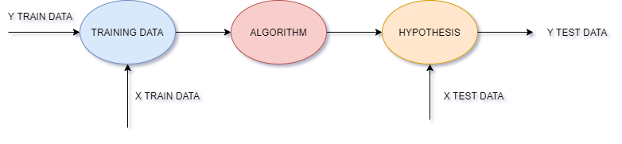
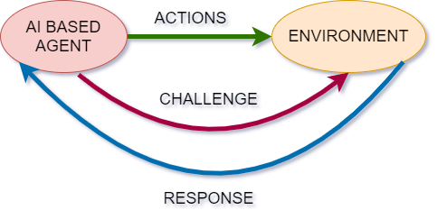

### 1. Introduction
##### Machine Learning
- It deals with building smart,intelligent machines
- It is a supfield of Artificial Intelligence (AI)
- Three types namely, Supervised, Unsupervised and Semi-supervised
 >Machine Learning can be defined as creating statistical models to mimic 'intelligent' decision makinh models and building 'smart' applications or devices.
- Applications include: Photo based applications, Chatbots, Games, Robotics, Creative AI and much more!
##### Some Common Terms in ML
1. Input Features : All possible features of an object
2. Training Set : Combination of input and output data ( Used for learning and teaching the machine )
3. Testing Set : Collection of only input ( Used for predicting and checking the algo )
4. Hypothesis : A function of the form f(x)=y where x is the input data and y is the output data

##### Supervised Learning
Supervised Learning is the learning in which the model learns from the past and generalise precdiction for future data. 
Supervised Learning is used for **Regression** and **Classification** problems. 

A simple flowchart for Supervised Learning is shown below:

-Applications include: Spam detection,document classification,NLP,Image Classification,Sequence Processing and much more!

##### Unsupervised Learning
Unsupervised Learning is the no supervision learning in which grouping of similar data takes place (**Clustering**). 
-Also there are no labels available (only input is available). 
-Pattern finding takes place to predict outputs

##### Semi-supervised Learning
In semi-supervised Learning manual labelling of some data points takes place(**Rule based Learning**). 
-Applications include: Object Segmentation, Similarity detection, Automatic labelling and much more!

##### Reinforcement Learning
Reinforcement Learning is used in computer games and is similar to hoe humans learn and react to situations.

Following diagram shows a simple flowchart to represent reinforcement learning: 

1. AI based Agent - Object which interacts with the environment 
2. Environment - Entire game ( incase of games )
