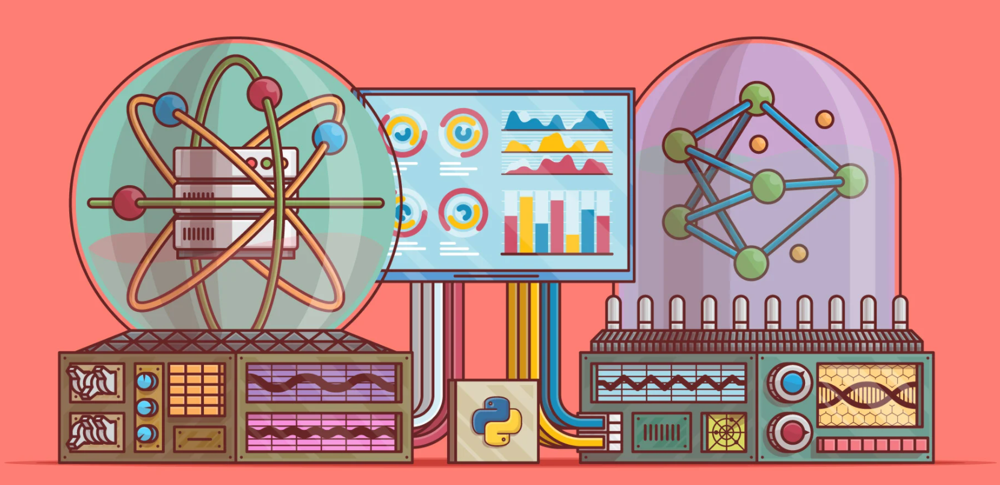
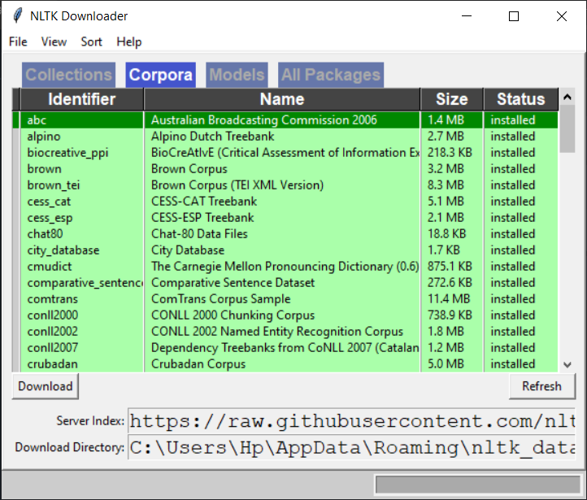

# Natural Language Processing ToolKit (NTLK)

This toolkit is one of the most powerful NLP libraries which contains packages to make machines understand human language and reply to it with an appropriate response. NLTK has been called “a wonderful tool for teaching, and working in, computational linguistics using Python,” and “an amazing library to play with natural language.”

It provides you with around 50 corpus data (corpus are large collections of data). To get these corpuses we use **ntlk.download()** and the following window appears and you can download the necessay corpuses:

# Bag of Words Pipeline

The pipeline includes the following steps:

1. Getting Data/Corpus
2. Tokenisation: Breaking words into smallest tokens possible
3. Stopwords Removal: Removing words which have less significance/no meaning
4. Stemming or Lemmatization: Converting different forms of words to their base forms
5. Building a Vocab: A list of all unique words and assigning indexes to each word
6. Vectorization: Converting the sentences/words into numeric forms by making us of the indexes accquired by them in the Vocab
7. Classification Process
